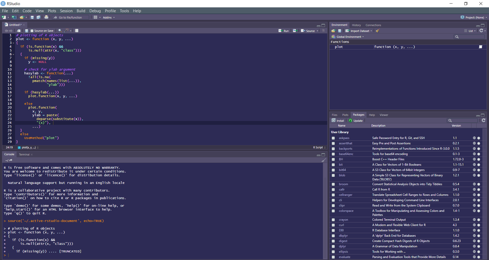

# 🦄 Shades of Purple `.RsTheme`

 > A shades of purple theme for Rstudio
 
 

## How to install:

### 1. Copy and paste this code in your console

```{r}
sop_theme <- fs::path_temp("sop_rstudio", ext = "rstheme")
download.file(url = "https://git.io/JeXwk", destfile = sop_theme)
rstudioapi::addTheme(sop_theme, apply = TRUE)
```
### 2. Enjoy your new purple paradise 💜🎵
